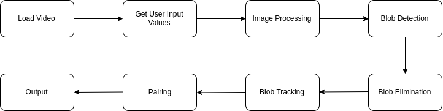
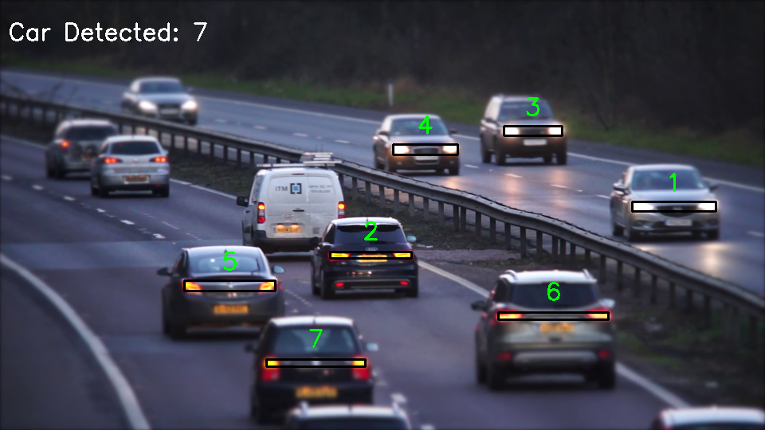
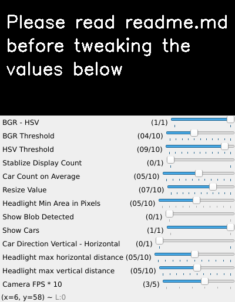

# Vehicle-Headlight-Tracker

This is simple program that detects and tracks cars on the road using headlights. It detects the lights and pair their movement as moving cars. When light source is not moving for some time, it will be excluded from grouping and treated as background light.

Detection is done using OpenCV built in `cv2.findContours` function. Pairing and tracking is done using some simple vector and trigonometry to identify movement direction.

## Running

Install the requirements

```shell
pip3 install requirements.txt
```

In [detect.py](detct.py) line 7, input a video path as follow, `cap = cv2.VideoCapture('video/1.mp4')`

Then, run the file

```shell
python3 detect.py
```

## How it works

Here is a simple flow chart of how the project works



The program outputs 2 windows, namely 'Output' and 'Controller'. As the name suggests, the 'Output' window show the result of the processed window while 'Controller' is used to control the variables of algorithm for better performances.

Here is a simple explaination of how the project works step by step.

1. Load the video and run the program
2. Read the values from controller panel
3. Process frame with values read
4. From current frame, a [Blob](blob.py) object is created for each blob of bright spot in frame
5. Eliminate uninterested blob
6. Track the movement of each blob from entering until leaving the frame
7. Match pair of blobs together as a car
8. Output car detected

To understand to program better, read the [User Manual](#user-manual) on how to use the controller panel. Then, read the [documentation](docs.md) that breaks down the code with explaination.

## Sample Output

Sample output of processed video frame



Sample image of controller panel



## User Manual

The algorithm output with 2 windows, namely 'Output' and 'Controller'. As the name suggests, the 'Output' window show the result of the processed window while 'Controller' is used to control the variables of algorithm for better performances

The variables of the controller are as below:

1. BGR - HSV

> Toggle between using BGR (Blue Green Red) and HSV (Hue Saturation Value) to detect headlight
> 0: BGR
> 1: HSV
> Default value: HSV
>
> HSV is more sensitive compare to BGR in terms of light, hence, it is generally better than BGR. BGR tends to pick up white pixels as light as well, which leads to low accuracy. At very specific situation, BGR will higher accuracy. So, toggle to BGR setting only when HSV is picking up a lot of errors.

2. BGR Threshold

> Threshold value or simply the brightness to be categorized as light source. The higher the value, the brighter the pixel has to be for the algorithm to pick it up as light source
> Min value: 0
> Max Value: 10
> Default Value: 4
> In HSV mode, this value does not affect the algorithm in any way

3. HSV Threshold

> Threshold value or simply the brightness to be categorized as light source. The higher the value, the brighter the pixel has to be for the algorithm to pick it up as light source
> Min value: 0
> Max Value: 10
> Default Value: 9
> In BGR mode, this value does not affect the algorithm in any way

4. Stablize Display Count

> Toggle to stablize the display of car count. The value changes EVERY FRAME, in 30FPS video you can't see anything, unless you are Superman. When turned on, it simply take display the average count of every few frames
> 0: Off
> 1: On
> Default Value: Off

5. Car Count on Average

> How long you want display of car count to update (per frame)
> Min Value: 0
> Max Value: 10
> Default Value: 5
> When 'Stablize Display Count' is off, this value does not affect the algorithm in any way

6. Resize Value

> Resize the output window, the larger the value, the larger the window size
> Min Value: 0
> Max Value: 10
> Default Value: 7

7. Headlight Min Area in Pixels

> The minimum the area of light needs to be for the algorithm to take it as headlight of a car. The value is given in 10 pixels, i.e. value of the bar at 2 refers to 20 pixels
> Min Value: 0
> Max Value: 10
> Default Value: 5
> Disclaimer: Do NOT attempt to ~~be stupid~~ put the value as 0. If you put the value at 0 and wonder why the algorithm is not detecting any car......... wait for it........ because headlight can be smaller than nothing. Conclusion? Don't put 0!
> Since it is in pixels, if you made the video output way too small by changing the resize value, at the point where all light source are smaller than 10 pixels, nothing will be detected as well

8. Show Blob Detected

> Toggle to show all blobs or the potentials headlight detected. You can use this to view what is being picked up by the algorithm
> 0: Off
> 1: On
> Default Value: Off

9.  Show Cars

> Toggle to show the cars (the numbering and boxes around the headlight pairs)
> 0: Off
> 1: On
> Default Value: On

10.  Car Direction Vertical - Horizontal

> The direction of the car movement. The car could be moving horizontally or vertically in the video, toggle this to change the detection mode
> 0: Vertical
> 1: Horizontal
> Default Value: Vertical

11.  Headlight max horizontal distance
> The horizontal distance between the headlight pair of a car (in pixel).
> Min Value: 0
> Max Value: 10
> Default Value: 5
> The scale of the value changes according to the direction of the car. When the car is moving vertical, per tick on the track bar refers to 40 pixels; while the car is moving horizontal, per tick on the track bar refers to 5 pixels

12.  Headlight max vertical distance
> The vertical distance between the headlight pair of a car (in pixel).
> Min Value: 0
> Max Value: 10
> Default Value: 5
> The scale of the value changes according to the direction of the car. When the car is moving horizontal, per tick on the track bar refers to 40 pixels; while the car is moving vertical, per tick on the track bar refers to 5 pixels

13.  Camera FPS * 10
> The FPS of the camera that captures the video, not the video nor display itself. The higher the FPS of camera, the smaller the distances of the light move from one frame to another. It is used to track the movement of the light. The value per tick in the track bar refer to 10FPS
> Min Value: 0
> Max Value: 5
> Default Value: 3
